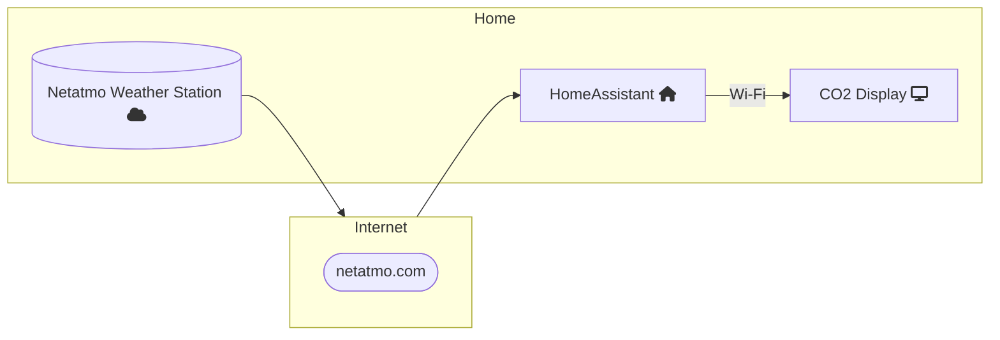

This is an [ESPHome](https://esphome.io/)-based display for the [Netatmo weather station](https://www.netatmo.com/en-gb/weather/weatherstation). The primary goal is to display the indoor CO2 concentration in my home office, so that I know when to open a window or when to close it to potentially save money on heating.

The device itself is not a CO2 monitor and requires Netatmo to be working with HomeAssistant.

Currently the display assumes there is one weather station with two additional indoor modules and one outdoor module. Names are currently hardcoded.

## Usage

1. Get [M5StickC](https://shop.m5stack.com/products/stick-c). The code may work on other devices but I didn't try. Let me know if there are other devices that work.

2. Set up HomeAssistant and [add Netatmo integration to it](https://www.home-assistant.io/integrations/netatmo/).

3. Create `secrets.yaml` file. Use `secrets_example.yaml` as an example. Make sure to set correct wifi and HomeAssistant passwords.

4. Compile, upload and run the code: `esphome run netatmo-display.yaml`

# Known issues

## Not starting after fully discharged

After flashing via ESPHome M5StickC may not be able to restart after fully discharged.

Workaround is to flash one of the examples using M5burner. See https://docs.m5stack.com/en/quick_start/m5core/uiflow - just flash one of the examples to revive M5StickC and then re-flash using esphome as above.

# TODO

* Make sensor names and their counts configurable.
* Improve error handling. The screen currently acts weird if one or more of the sensors are not available.
