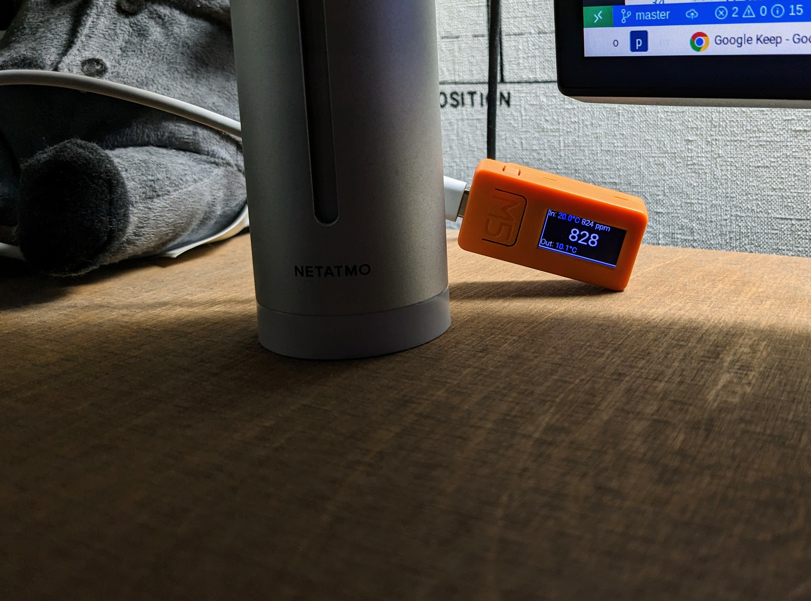

This is [ESPHome](https://esphome.io/)-based display for [Netatmo weather station](https://www.netatmo.com/en-gb/weather/weatherstation). The primary goal is to display indoors CO2 concerntation in my home office so that I know when to open a window. Or when to close and hopefully save some money on heating.

The device itself is actually not a CO2 monitor and requires Netatmo as working HomeAssistant.

Currently the display assumes there is one weather station with two additional indoor modules and one outdoor module. Names are currently hardcoded.

## Usage

1. Set up HomeAssistant and [add Netatmo integration to it](https://www.home-assistant.io/integrations/netatmo/).

2. Create `secrets.yaml` file. Use `secrets_example.yaml` as an example. Make sure to set correct wifi and HomeAssistant passwords.

3. Compile, upload and run the code: `esphome run netatmo-display.yaml`

# TODO

* Make sensor names and their counts configurable.
* Improve error handling. The screen currently acts weird if one or more of the sensors are not available.
